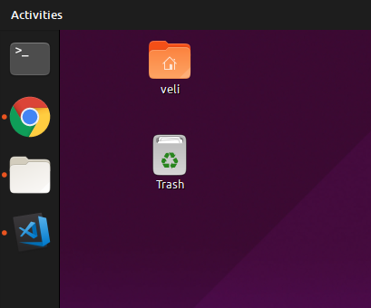

# Ubuntu Desktop Icons
* This extension aims to fix alignment problem with desktop icons on Ubuntu.
* This is an exact copy of `Desktop Icons`, which is a default GNOME extension on Ubuntu GNOME.
* You might need to remove `Desktop Icons` extension in order to properly make use of this extension.
* There is also a setting which enables you to change the placement of the Ubuntu Launcher.

## Installation
* Open terminal.
* We are removing the `Desktop Icons` now.
* Run `sudo rm -r /usr/share/gnome-shell/extensions/desktop-icons@csoriano`
* *Note: To reinstall it, you can use GNOME Extensions which will install it as a user extension.*
* Now download the latest release of `Ubuntu Desktop Icons` from this repo.
* Run `mkdir -p ~/.local/share/gnome-shell/extensions/ubuntu-desktop-icons@velitasali.github.io`
* Extract the zip file into the previously created folder.
* Now, if you are not on Wayland, you can do `Alt + F2` and type and enter `restart` to restart the GNOME Shell.
* If you are, then logging out and logging back in should do the trick.
* Then, enter GNOME Tweaks and enable the `Ubuntu desktop icons`.
* You are good to go!

# Screenshots
